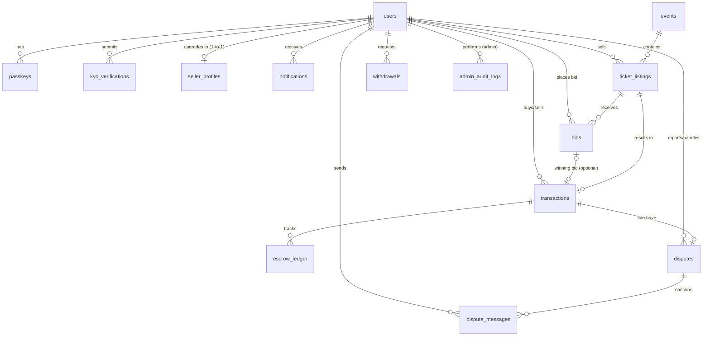

# 🛡️ SafeGate Ticket - Marketplace Tiket Sekunder Berbasis Lelang Aman

SafeGate Ticket adalah platform marketplace tiket sekunder (reseller) berbasis lelang (*auction*) yang dirancang khusus untuk menciptakan ekosistem transaksi tiket yang adil, aman, dan transparan. Platform ini meminimalisir penipuan tiket (*scalping/scamming*) dengan mengintegrasikan sistem **Rekening Bersama (Escrow)**, verifikasi identitas **KYC (Know Your Customer)**, dan sistem deposit jaminan lelang yang ketat.

---

## 🚀 Fitur Utama

SafeGate Ticket dilengkapi dengan berbagai fitur backend dan alur logika bisnis yang kuat:

1. **Sistem Lelang Otomatis (Pseudo-Cronjob)**
   * Menutup lelang tepat waktu secara otomatis tanpa memerlukan daemon cronjob server Linux yang rumit.
   * Sistem memeriksa status lelang aktif (`auction_end_at <= NOW()`) setiap ada aktivitas pemuatan halaman (*page load*) melalui fungsi `sg_run_cronjobs()`.

2. **Logika Batas Waktu Pembayaran & Runner-up (Cascade Winner)**
   * Pemenang lelang utama diberikan batas waktu pembayaran ketat selama **2 jam**.
   * Jika tidak ada pelunasan dalam batas waktu tersebut, status pemenang pertama hangus (*forfeited*), uang jaminan disita, dan sistem secara otomatis mengalihkan status pemenang ke penawar tertinggi berikutnya (*runner-up*).

3. **Sistem Deposit Jaminan Lelang (Bid Deposit)**
   * Untuk mencegah penawaran palsu/fiktif, setiap pengguna yang ingin mengajukan penawaran (*bid*) wajib memiliki saldo jaminan sebesar **Rp 50.000** di dompet digital mereka.
   * Dana jaminan tersebut akan dikunci (*locked*) selama lelang berlangsung. Jika kalah, dana akan dikembalikan penuh. Jika menang dan melarikan diri, dana disita sebagai denda.

4. **Integrasi Webhook & Callback Midtrans**
   * Pembayaran tiket diproses secara otomatis melalui payment gateway Midtrans Snap.
   * Status transaksi terupdate secara riil-time menggunakan webhook asinkron (`midtrans_notification.php`) untuk memeriksa keselarasan pembayaran (*settlement*).

5. **Rekening Bersama Aman (Escrow Ledger)**
   * Menampung dana pembayaran pembeli secara sementara di akun penampungan escrow platform.
   * Dana hanya dicairkan ke saldo penjual (*released*) ketika pembeli melakukan pemindaian QR Code tiket yang valid di lokasi acara, atau dapat ditahan jika pembeli melaporkan masalah (*dispute*).

6. **Proteksi Rute & Verifikasi KYC (Know Your Customer)**
   * Mencegah akun bot/fiktif menjual tiket palsu. Halaman penjualan tiket dilindungi oleh pengecekan status KYC. Pengguna wajib mengunggah foto KTP dan selfie untuk ditinjau oleh Admin sebelum diizinkan menjual tiket.

7. **Brevo Mailer Engine (REST API Integration)**
   * Mengirimkan notifikasi email secara riil, cepat, dan aman dari filter spam menggunakan integrasi API HTTP POST cURL ke layanan Brevo API.

---

## 🛠️ Tech Stack yang Digunakan

Projek ini dibangun menggunakan kombinasi teknologi modern untuk kinerja optimal, keamanan, dan fleksibilitas:

* **Backend Engine:** PHP (Procedural-Modular)
* **Database Management:** MySQL (dengan library **PDO** dan *Prepared Statements* untuk proteksi penuh terhadap SQL Injection)
* **Frontend & UI:** Vanilla HTML5 & CSS3 (Desain kustom modular melalui `global.css` dan `admin.css`), Google Fonts (Inter), dan Iconify Icons
* **Library & SDK Terintegrasi:**
  * `midtrans/midtrans-php` (Midtrans PHP SDK untuk integrasi pembayaran online)
  * `vlucas/phpdotenv` (Manajemen konfigurasi variabel lingkungan `.env`)
  * `phpmailer/phpmailer` (Library email engine tambahan)
  * Brevo REST API (via HTTP POST cURL PHP)

---

## 📊 Arsitektur Database & ERD

Database SafeGate Ticket dirancang secara terstruktur untuk menjamin integritas transaksi dan riwayat lelang. Berikut adalah Entity Relationship Diagram (ERD) dari database SafeGate Ticket:



---

## 👥 Kontributor Projek

Projek ini dikembangkan dan dikelola oleh kontributor berikut yang terdaftar secara otomatis melalui GitHub:

<a href="https://github.com/Aris-Kurniawan/Website-SafeGate-Tikcet/graphs/contributors">
  
</a>

### Daftar Nama Kontributor:
* **Aris Kurniawan** ([@Aris-Kurniawan](https://github.com/Aris-Kurniawan))
* **Sabilu Rosyada** ([@sabiluu](https://github.com/sabiluu))
* **Hanif** ([@biru16660](https://github.com/biru16660))
* **Putri Nurma** ([@putrinurma2007](https://github.com/putrinurma2007))

Dibuat dengan kontribusi aktif. Anda dapat melihat daftar lengkap kontributor dan kontribusi mereka secara langsung di GitHub.

---

## ⚙️ Cara Menjalankan Projek Secara Lokal

1. **Clone repositori:**
   ```bash
   git clone https://github.com/Aris-Kurniawan/Website-SafeGate-Tikcet.git
   cd Website-SafeGate-Tikcet
   ```
2. **Install dependensi PHP via Composer:**
   ```bash
   composer install
   ```
3. **Konfigurasi Environment:**
   * Duplikat file `.env` atau buat file `.env` baru di root folder projek.
   * Masukkan detail database MySQL, API key Midtrans, dan API key Brevo Anda.
4. **Import Database:**
   * Import file database yang berada di `database/safgate_db.sql` ke server MySQL lokal Anda (misal phpMyAdmin).
5. **Jalankan web server:**
   * Letakkan folder projek di direktori web server Anda (misal `C:/xampp/htdocs/` untuk XAMPP).
   * Buka browser dan akses `http://localhost/Website-SafeGate-Tikcet`.
